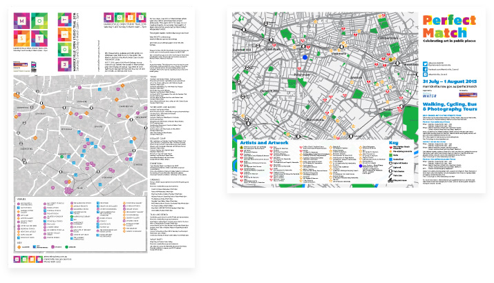
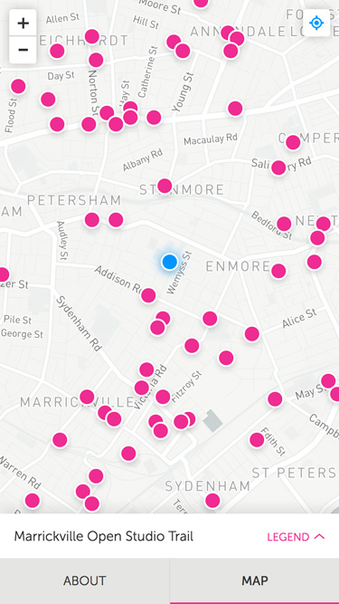
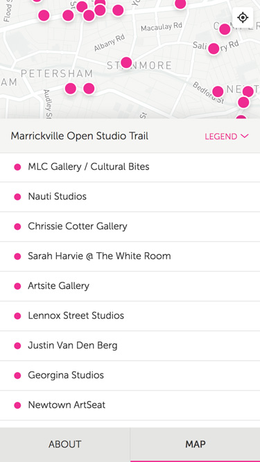
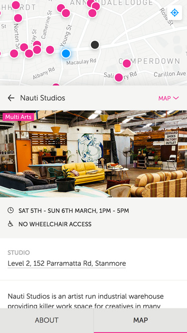
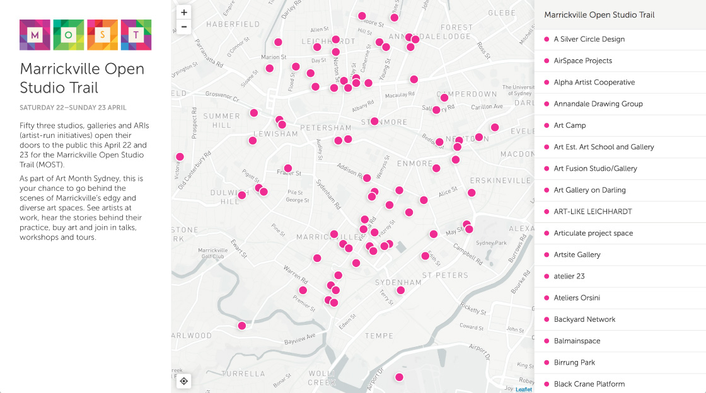

The Inner West is home to some of Sydney’s most vibrant independent art communities.

The Inner West’s Art Post department holds a number of annual events which see studios, galleries and other artist-run initiatives open their doors to the public.

This Little Duck was approached by the Inner West Council about creating a mobile-first digital program for Art Post. They wanted a way to provide users with timely updates on the day of the event, such as time, venue changes, etc.

<picture>
  <source srcset="art-post--pdf.jpg 1x, art-post--pdf@2x.jpg 2x">
  
</picture>

## Design

After an audit of the PDF programs Art Post typically provides, we prioritized the map as one of the most useful features. We realised we could add value with location based services on mobile devices. As users would predominantly be on their mobile devices on the day of the event, the web app needed to be responsive—with an emphasis on mobile-first design.

  

    

      

        <picture>
          <source srcset="art-post--mobile-1.jpg 1x, art-post--mobile-1@2x.jpg 2x">
          
        </picture>
       

    

    

      

        <picture>
          <source srcset="art-post--mobile-2.jpg 1x, art-post--mobile-2@2x.jpg 2x">
          
        </picture>
       

    

    

      

        <picture>
          <source srcset="art-post--mobile-3.jpg 1x, art-post--mobile-3@2x.jpg 2x">
          
        </picture>
       

    

  

For the digital program, I designed the experience around the concept of an interactive map. Users at the event would explore the art around themselves through tracking their location on the map, tapping on a map pin for more information about that particular venue, and by easily navigating between map pins.

In our audit, we discovered that there were typically around 40-60 venues for a particular event, each needing a pin on the map. With this in mind, I designed the user interface around keeping the map pins in context of the user’s place on the map. When the user tapped a pin, they wouldn’t feel like they were being taken to an entirely new page—instead, they could continue to interact with the other pins on the map.

Although our emphasis was on a mobile-first experience, the app would be responsive - so we needed to ensure it would look great and work smoothly across a variety of screen sizes. So I designed the user interface around two screen configurations.

On small screens, the user has the option of hiding the overlay displaying the legend and pin detail. This maximises the space for the map area. I placed most primary interactions at the bottom of the screen, so thumbs don’t have to reach too far to navigate. The about section is hidden in it’s own tab.

<picture>
  <source srcset="art-post--desktop.jpg 1x, art-post--desktop@2x.jpg 2x">
  
</picture>

For larger screens, I took advantage of the extra screen real estate and to keep the overlay detail visible at all times.

As the maps would be adapted for multiple campaigns, the visual design needed to be fairly neutral. I incorporated elements of the Inner West council’s print material, such as the font Museo Sans and use of white space. I also designed the option to change the pin colour depending on the campaign - although this feature didn’t make it into the final product.

<picture>
  <source srcset="art-post--patternlab.jpg 1x, art-post--patternlab@2x.jpg 2x">
  
</picture>

## Development

When it came to development, I provided responsive templates (HTML & CSS) and a pattern library of components coded using mobile-first practices. The user interface was then developed in Ember.js by the development team, and I worked closely with them to get the interactions just right.

## Reflection

Initially, our client’s budget provided for a larger scale platform. This included sorting filters, dynamic legends, and richer content for map pins, and my original design took this into account. Unfortunately, this budget was scaled back which affected the final product. This was a bit disappointing, but it gave us an opportunity to really refine the experience of the map and pin detail.

If I had a chance to go back to this project, I’d gather more user feedback and implement some filtering options. There are a few interactions I would improve, too. There’s an opportunity to improve context for users with the transition between the map legend and the map pin detail. At the moment, the content just sort of clunks-in. It would be nice to add a transition that slides the map pin detail over the top of the legend.

I’d also like to give more context to map pins regarding which map legend item correlates to which pin. At the moment, it relies on a hover state—which is not at all mobile friendly.