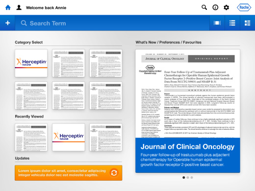
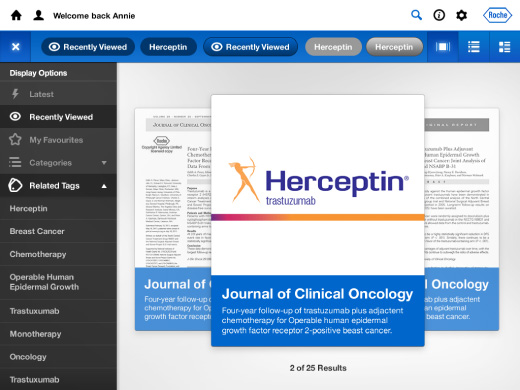
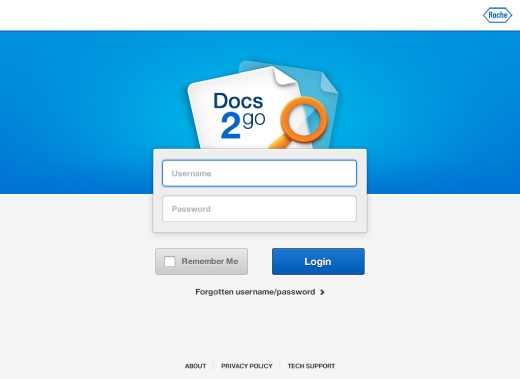
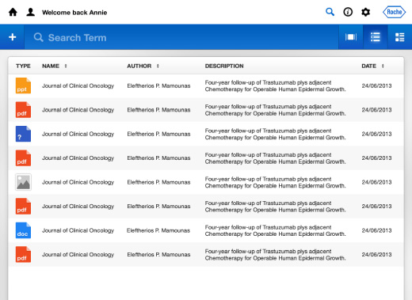
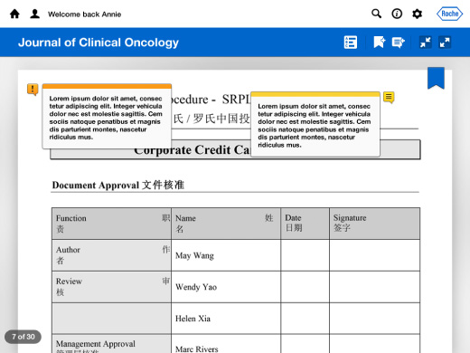
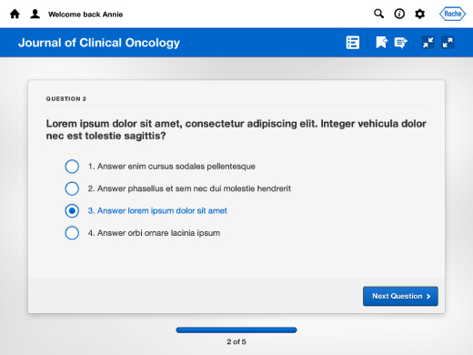

Lorem ipsum dolor sit amet, consectetur adipisicing elit. Dolores eum voluptatibus sit dolorum accusamus rem maiores id nobis laborum ut, quas alias aspernatur facilis tenetur, reprehenderit, incidunt hic eos iste perspiciatis. Quae illo dolorem obcaecati laudantium aliquam deleniti sequi.

  

    

      <picture>
        <source srcset="docs-2-go--01.jpg 1x, docs-2-go--01@2x.jpg 2x">
        
      </picture>
    

    

      <picture>
        <source srcset="docs-2-go--02.jpg 1x, docs-2-go--02@2x.jpg 2x">
        
      </picture>
    

  

  

    

      <picture>
        <source srcset="docs-2-go--03.jpg 1x, docs-2-go--03@2x.jpg 2x">
        
      </picture>
    

    

      <picture>
        <source srcset="docs-2-go--04.jpg 1x, docs-2-go--04@2x.jpg 2x">
        
      </picture>
    

  

  

    

      <picture>
        <source srcset="docs-2-go--05.jpg 1x, docs-2-go--05@2x.jpg 2x">
        
      </picture>
    

    

      <picture>
        <source srcset="docs-2-go--06.jpg 1x, docs-2-go--06@2x.jpg 2x">
        
      </picture>
    

  

