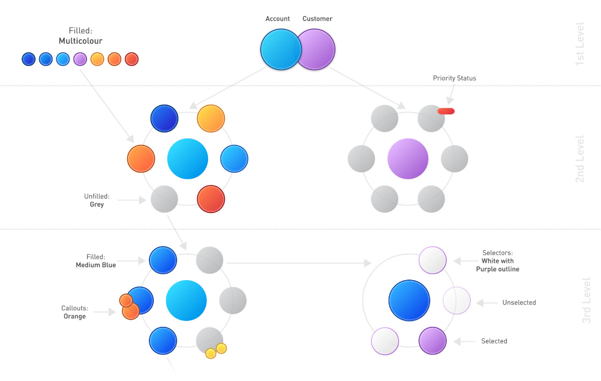
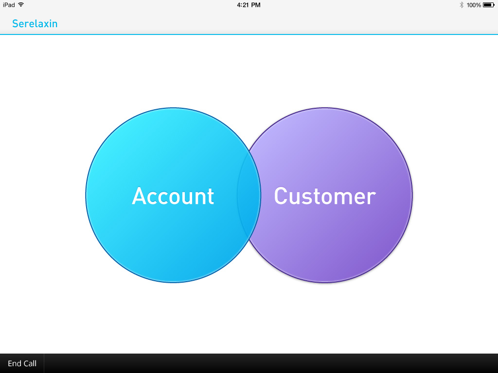
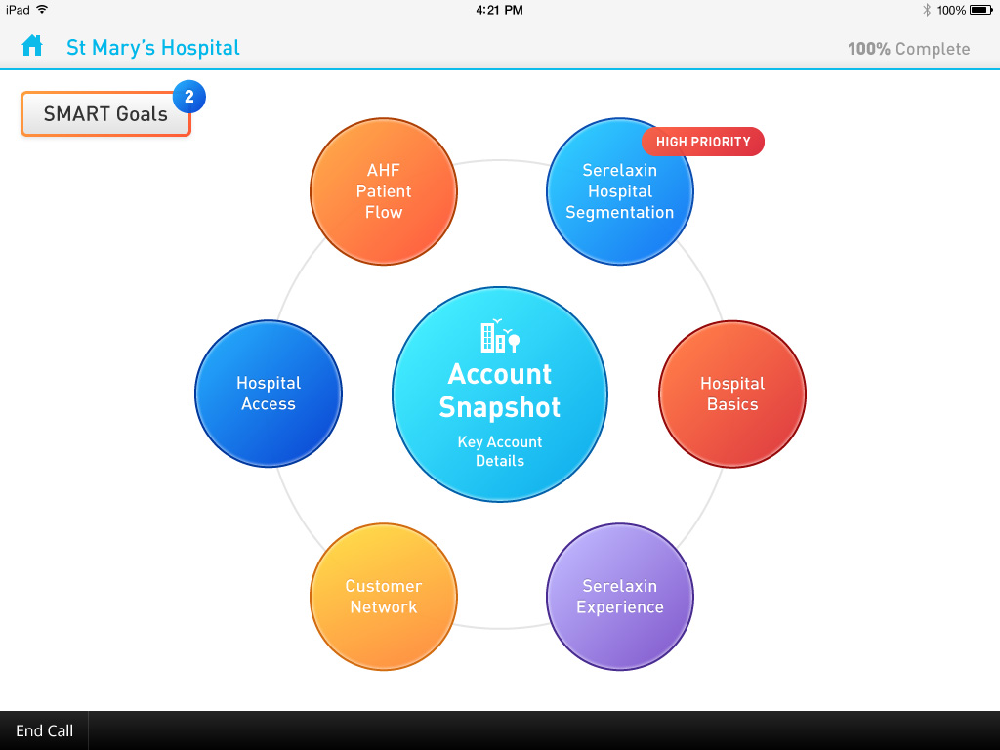
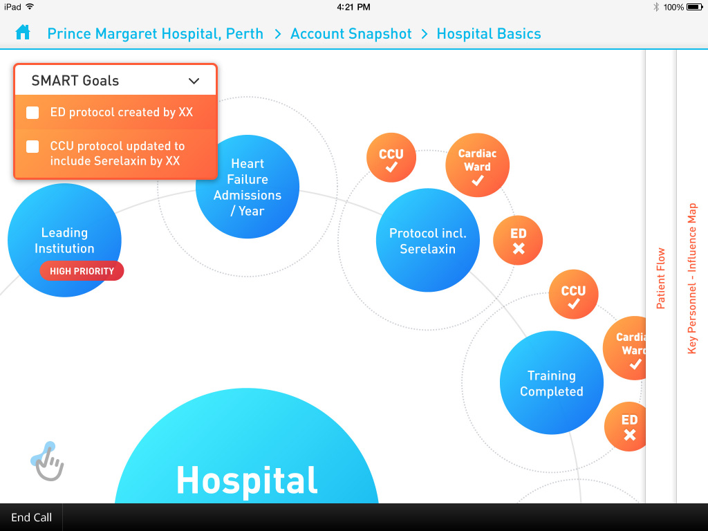
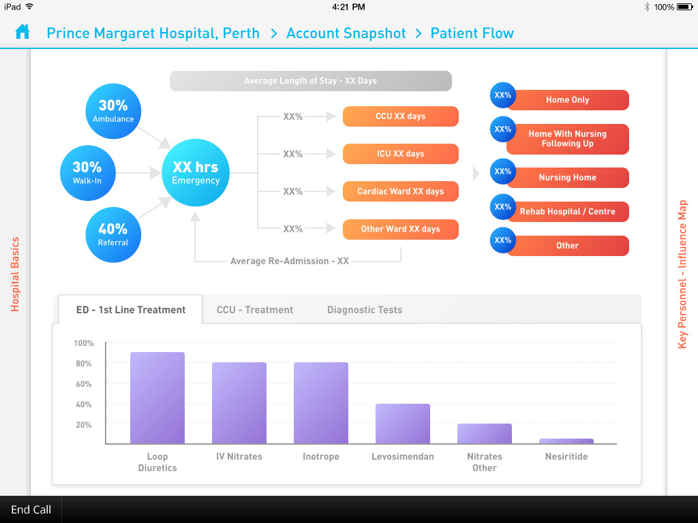
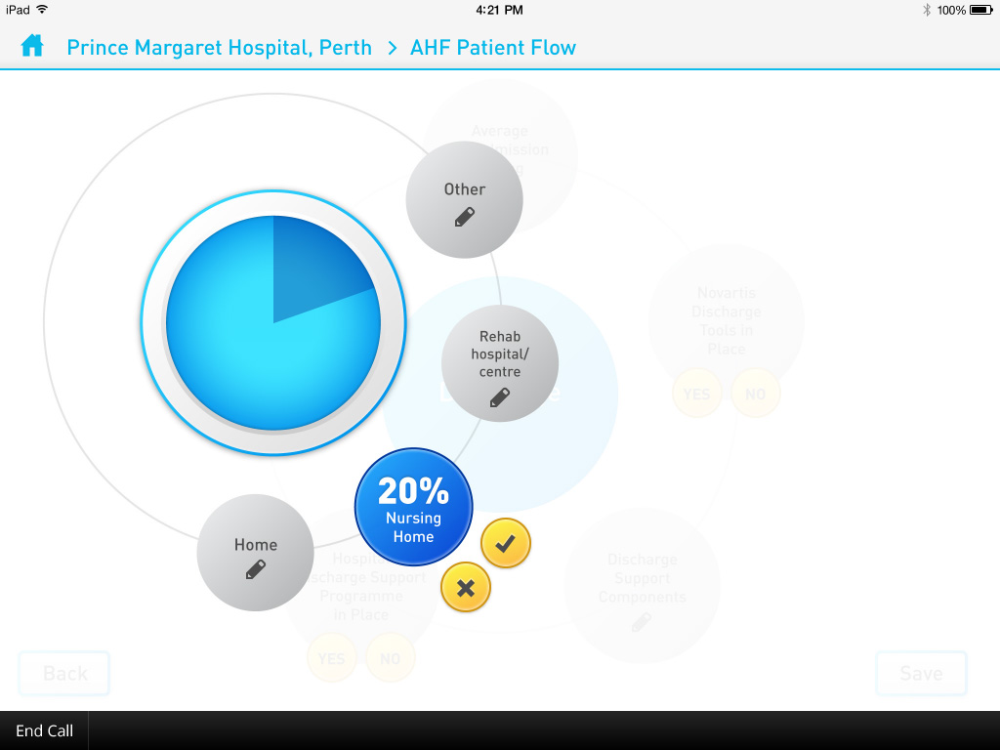
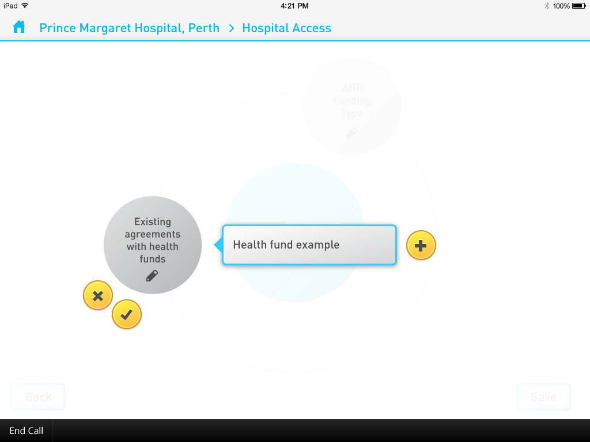

Maps is a series of interactive infographic style forms. I designed the UI, interactions and animations of the first two Maps apps, the original ‘Xolair Maps’ and ‘Serelaxin Maps’. I also developed the static templates and animation for the apps and online analytics portals.

Maps was originally designed as it’s own standalone iPad app, but was later refactored as a module to fit into the <a href="http://www.fieldintouch.com/" target="_blank">Field InTouch</a> platform, which I also designed. Featured here is the ‘Serelaxin Maps’ iteration.

Maps was rolled out across several of the Novartis pharmaceutical brands to aid field-force reps in collecting client data. The user moves through either the account or customer section for each client, filling out each ‘unfilled’ grey bubble. The bubbles then become populated with data and colour, giving the rep an easy way to get a quick overview of a call’s completion and status. Each unfilled bubble represents a question or can open up into it’s own set of questions, only becoming ‘filled’ when each sub-question has been completed.

In some instances there were 5 ‘levels’ of questions that needed to be completed, so it was important for the rep to be aware of which level they were in and to understand the functions of the various types of buttons. In addition to breadcrumbs, I created a colour system to be used consistently across the app—the populated colour of bubbles would become darker as you moved through the levels.

<picture>
  <source srcset="novartis--color-map.jpg 1x, novartis--color-map@2x.jpg 2x" >
  
</picture>

  

    

      <picture>
        <source srcset="novartis--1.jpg 1x, novartis--1@2x.jpg 2x">
        
      </picture>
    

    

      <picture>
        <source srcset="novartis--2.jpg 1x, novartis--2@2x.jpg 2x">
        
      </picture>
    

  

  

    

      <picture>
        <source srcset="novartis--3.jpg 1x, novartis--3@2x.jpg 2x">
        
      </picture>
    

    

      <picture>
        <source srcset="novartis--4.jpg 1x, novartis--4@2x.jpg 2x">
        
      </picture>
    

  

  

    

      <picture>
        <source srcset="novartis--5.jpg 1x, novartis--5@2x.jpg 2x">
        
      </picture>
    

    

      <picture>
        <source srcset="novartis--6.jpg 1x, novartis--6@2x.jpg 2x">
        
      </picture>
    

  

