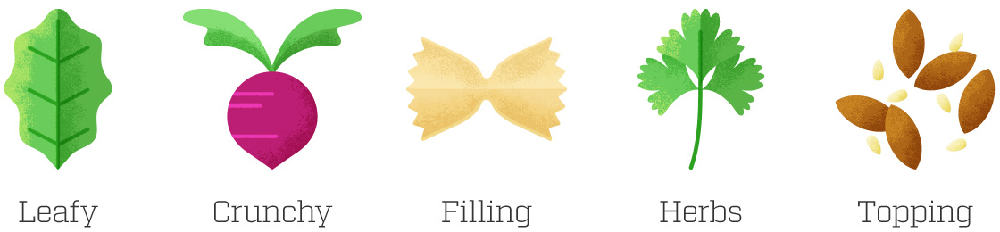
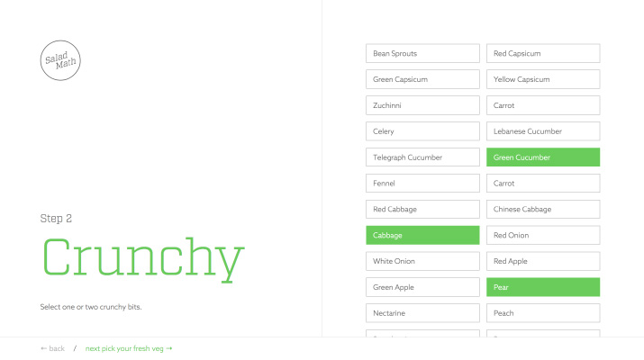
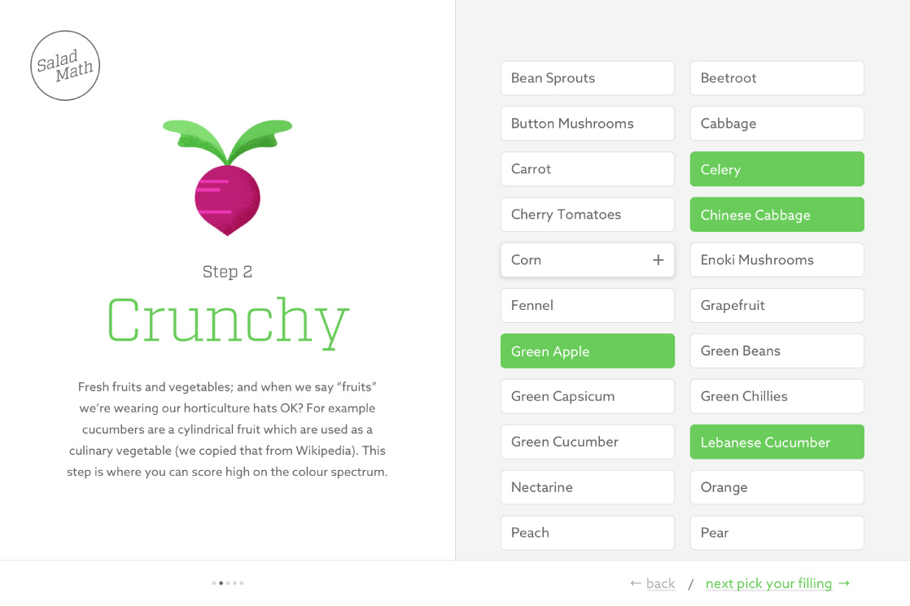
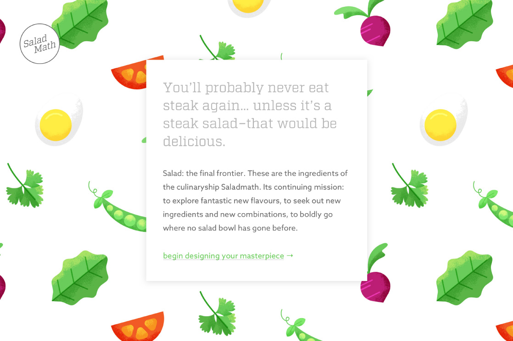
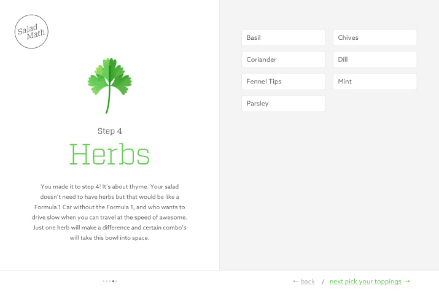
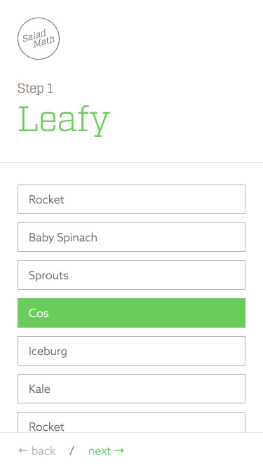
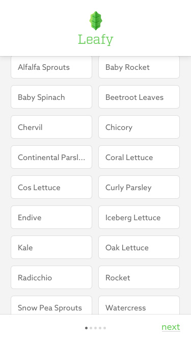
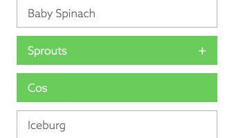
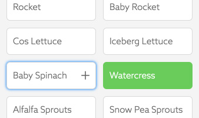
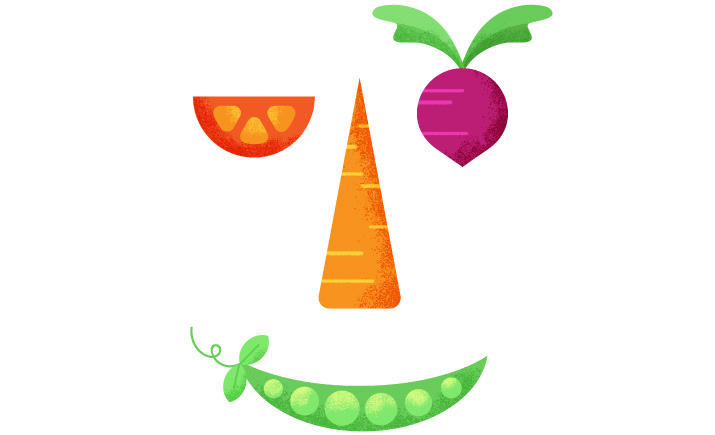

Salad Math is a quick experimental project we created at <a href="https://thislittleduck.com" target="_blank">This Little Duck</a> after we had wrapped up all of our client work for the year.

With two salad enthusiasts in the office, the idea for a salad calculator was born.

The target audience—our cooking-adverse colleagues, who would eat a chicken burger every day of their lives if they could get away with it, and never touch a piece of lettuce if they could possibly help it. We wanted an easy tool that could help them to create a tasty salad to bring for lunch.

<picture>
  <source srcset="salad-math--illustrations-01.jpg 1x, salad-math--illustrations-01@2x.jpg 2x" >
  
</picture>

The concept was simple. Create an equation, crack the formula behind creating a great tasting salad, and serve it up for our users with a pre-prepared shopping list. We devised six categories for building the perfect salad—leafy, crunchy, filling, herbs and toppings.

<figure class="case-study__img-inline">
  <picture>
    <source srcset="salad-math--prototype.jpg 1x, salad-math--prototype@2x.jpg 2x" >
    
  </picture>
  <figcaption>
    <svg role="img" aria-labelledby="title" class="icon icon--arrow-right-bent">
      <title>Arrow right bent icon</title>
      <use xlink:href="#icon--arrow-right-bent"></use>
    </svg>
    Salad Math Prototype
  </figcaption>
</figure>

## The Prototype

The initial prototype was an exercise in how quickly we could get something up. The first version was a simple step-by-step guide where the user can add items to their ‘Salad List’ from the six categories with guided instructions. I designed the user experience and then translated it into static html builds, while the rest of the team worked on creating content and developing the app in Ember.js.

You can check out the prototype [here](http://saladmath.com/).

<figure class="case-study__img-full">
  <picture>
    <source srcset="salad-math--design.jpg 1x, salad-math--design@2x.jpg 2x" >
    
  </picture>
  <figcaption>
    <svg role="img" aria-labelledby="title" class="icon icon--arrow-right-bent">
      <title>Arrow right bent icon</title>
      <use xlink:href="#icon--arrow-right-bent"></use>
    </svg>
    Expanding on the Visual Identity
  </figcaption>
</figure>

## Improving the UI and expanding the Visual Identity

After some initial feedback I identified some key areas to improve:

<figure class="case-study__img-full">
  <picture>
    <source srcset="salad-math--home.jpg 1x, salad-math--home@2x.jpg 2x" >
    
  </picture>
  <figcaption>
    <svg role="img" aria-labelledby="title" class="icon icon--arrow-right-bent">
      <title>Arrow right bent icon</title>
      <use xlink:href="#icon--arrow-right-bent"></use>
    </svg>
    Home screen introduction
  </figcaption>
</figure>
  
> *There isn’t enough guidance for users about what they are getting out of the tool, and how their salad ingredient choices are contributing to making a good salad.*

I designed a home screen to introduce the concept of Salad Math, and added descriptions to the category cover. I also illustrated an ingredient for each step. These changes have really elevated the playfulness of the app, while clarifying the process for the user.

<figure class="case-study__img-inline">
  <picture>
    <source srcset="salad-math--navigation.jpg 1x, salad-math--navigation@2x.jpg 2x" >
    
  </picture>
  <figcaption>
    <svg role="img" aria-labelledby="title" class="icon icon--arrow-right-bent">
      <title>Arrow right bent icon</title>
      <use xlink:href="#icon--arrow-right-bent"></use>
    </svg>
    Navigation updates
  </figcaption>
</figure>

> *There is no context for users in how far they are along in the process. This is contributing to users dropping off from a seemingly never ending list of steps.*

I improved the navigation by introducing pagination, which gives the user context about their progress within the six steps.

I also moved the step navigation over to the right size of the screen on larger viewports, which puts the ‘next’ button in closer proximity to the ingredients area. This makes it easier for users to move from picking salad items to navigating to the next screen, minimising any friction.

  

    

      <figure>
        

          <picture>
            <source srcset="salad-math--before.jpg 1x, salad-math--before@2x.jpg 2x">
            
          </picture>
        

        <figcaption>
          <svg role="img" aria-labelledby="title" class="icon icon--arrow-right-bent">
            <title>Arrow right bent icon</title>
            <use xlink:href="#icon--arrow-right-bent"></use>
          </svg>
          Before: The Prototype
        </figcaption>
      </figure>
    

    

      <figure>
        

          <picture>
            <source srcset="salad-math--after.jpg 1x, salad-math--after@2x.jpg 2x">
            
          </picture>
        

        <figcaption>
          <svg role="img" aria-labelledby="title" class="icon icon--arrow-right-bent">
            <title>Arrow right bent icon</title>
            <use xlink:href="#icon--arrow-right-bent"></use>
          </svg>
          After
        </figcaption>
      </figure>
    

  

> *The item list is particularly long on mobile and makes the entire experience of scrolling to add ingredients feel unwieldy.*

I introduced a 2 column layout for small screen sizes to fit twice the amount of salad items on screen. Then I increased the height of the salad item buttons and added in additional spacing so the items still had a clear touch area. This really condensed the information, while maintaining full usability.

  

    

      <figure>
        <picture>
          <source srcset="salad-math--hover-before.jpg 1x, salad-math--hover-before@2x.jpg 2x">
          
        </picture>
        <figcaption>
          <svg role="img" aria-labelledby="title" class="icon icon--arrow-right-bent">
            <title>Arrow right bent icon</title>
            <use xlink:href="#icon--arrow-right-bent"></use>
          </svg>
          Before: Deselected but item still appears selected
        </figcaption>
      </figure>
    

    

      <figure>
        <picture>
          <source srcset="salad-math--hover-after.jpg 1x, salad-math--hover-after@2x.jpg 2x">
          
        </picture>
        <figcaption>
          <svg role="img" aria-labelledby="title" class="icon icon--arrow-right-bent">
            <title>Arrow right bent icon</title>
            <use xlink:href="#icon--arrow-right-bent"></use>
          </svg>
          After: No more confusion :)
        </figcaption>
      </figure>
    

  

> *The hover state is confusing for touchscreen users. When you tap to ‘deselect’ an item the green hover state stays in place–according to the mobile browser, the button is still focused.*

The ingredient buttons have a hover state giving the user a small hint about the button’s function, with a ‘+’ icon fading in and the background turning green as if it were selected. Although this was intended to elevate the desktop experience, it is ultimately a hinderance on touchscreen devices.

I changed the hover state to only show a ‘+’ icon on hover while keeping the background the same as the white default ‘unselected’ state. This indicates to a desktop user that they are able to add the ingredient to their salad list. As the background is now white when the button is focused and unselected, it clearly indicates to a touchscreen user that that item is no longer selected.

Originally, the button was an anchor tag with javascript toggling an active state class. I changed this to use a checkbox input, which I styled based on the ‘checked’ attribute as they are inherently more accessible.

<picture>
  <source srcset="salad-math--salad-face.jpg 1x, salad-math--salad-face@2x.jpg 2x" >
  
</picture>