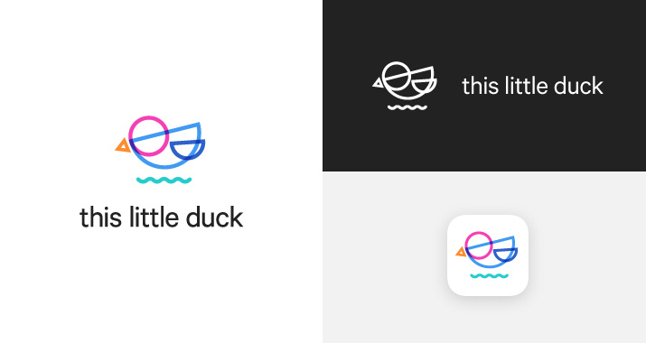
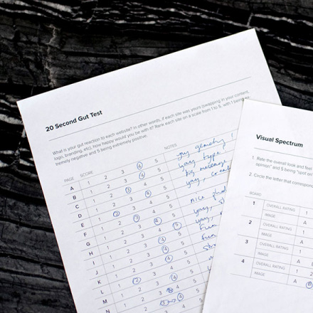
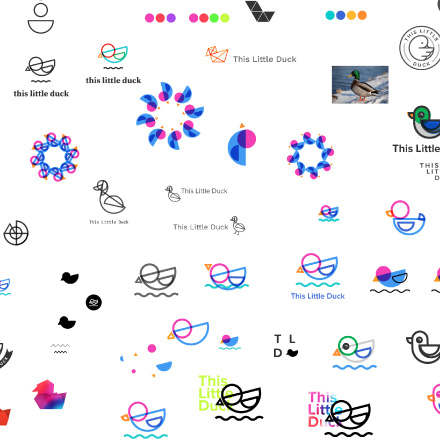
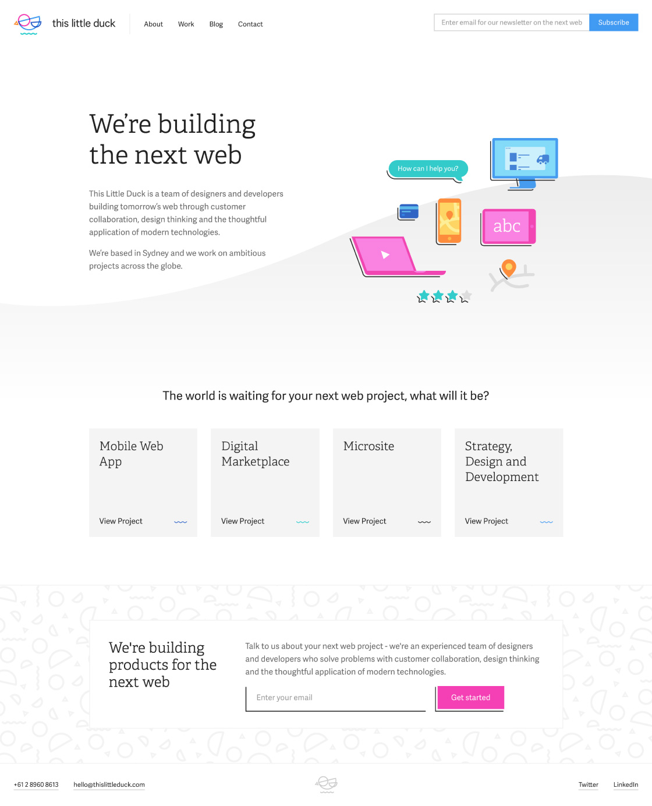
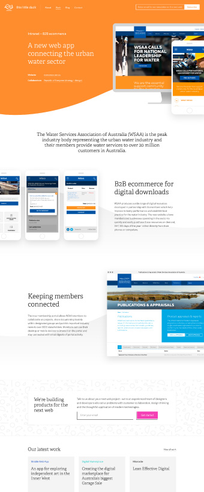
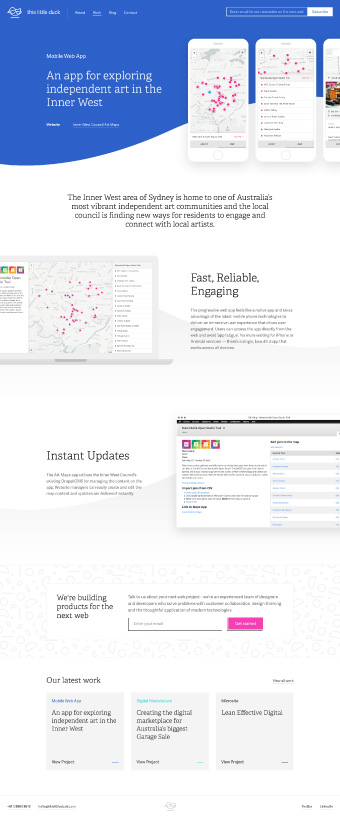
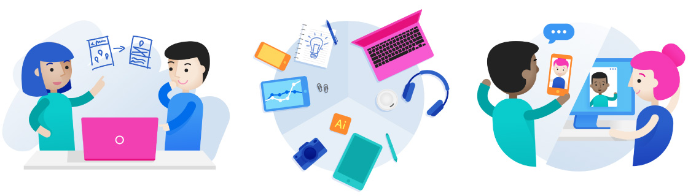
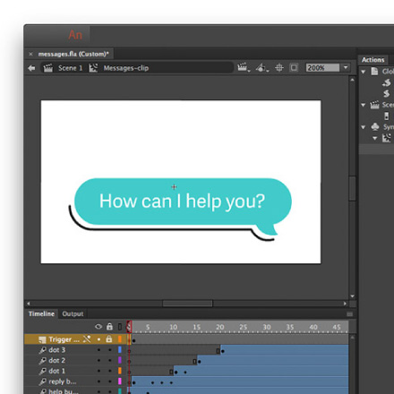

This Little Duck are a small team of highly skilled, multidisciplinary designers and developers, who are passionate about building the next web.

As part of my work with This Little Duck over the past two years, I led the company through a rebrand. This included a new visual language and website.

The first step I took was to run a brand workshop with my colleagues, to facilitate a conversation about where we were going as a company, where our true value lay and what this meant for the visual identity. I extracted key ideas about our vision, mission and values from the workshop and used them to build a “Core Identity” which was more in line with who we were as a business.

<picture>
  <source srcset="this-little-duck--brand.jpg 1x, this-little-duck--brand@2x.jpg 2x" >
  
</picture>

Afterwards, I published some posts detailing the process:

  <a href="https://thislittleduck.com/blog/rebuilding-a-brand-the-brand-workshop/" class="article-link" target="_blank">
    

      
    

    

      <h3>Rebuilding a Brand: the Brand Workshop  </h3>
      
Branding workshops are an essential tool for gathering those requirements and constraints when solving the problem: “why does your company exist?”

      
Read article
        <svg role="img" aria-labelledby="title" class="icon icon--arrow-right">
          <title>Arrow right icon</title>
          <use xlink:href="#icon--arrow-right"></use>
        </svg>
      

    

  </a>

  <a href="https://thislittleduck.com/blog/rebuilding-a-brand-core-identity/" class="article-link" target="_blank">
    

      
    

    

      <h3>Rebuilding a brand: from Workshop to Core Identity</h3>
      
What comes next after a brand workshop? How do you take a collection of ideas and develop them into a cohesive identity?

      
Read article
        <svg role="img" aria-labelledby="title" class="icon icon--arrow-right">
          <title>Arrow right icon</title>
          <use xlink:href="#icon--arrow-right"></use>
        </svg>
      

    

  </a>

After social media and business cards, the website was the next space to be refreshed with our new identity. This allowed us to expanded on the core visual identity, including typography, use of space, UI elements and illustration.

One of the biggest challenges I’ve faced when designing a web presence for a company or portfolio is the lack of a brief, or of any clear requirements. This project provided a striking example of what that challenge can look like, and how it can be handled. I wouldn’t start designing for a client without interrogating the problem or starting with a brief and a strategy in mind, so why would it be any different when designing for our own company?

I worked closely with our director to develop the concept for the homepage. We decided to base the website around a simple idea, a message to clients and potential clients—“The web isn't just your website”. We encourage our customers to fully leverage the magic of the internet where it will provide value to their product.

<picture>
  <source srcset="this-little-duck--home.jpg 1x, this-little-duck--home@2x.jpg 2x" >
  
</picture>

## The Design

First, I mocked up the homepage for the site. This is where I was able to lock down the typography, the overall look and feel of the site, as well as global components such as the navigation. As our web presence was especially lacking before this point, we worked iteratively, first creating the smallest thing we could launch to get it live as quickly as possible. This gave us a great opportunity to get lots of feedback, to add new components, and to flesh out pages as needed.

After design, I developed responsive templates (HTML & CSS) and a <a href="http://styleguide.thislittleduck.thislittleduck-sites.com/" \ target="_blank">pattern library</a> of components. The development team then fitted out the site in static site generator Hugo.

  

    

      <picture>
        <source srcset="this-little-duck--case-study-1.jpg 1x, this-little-duck--case-study-1@2x.jpg 2x">
        
      </picture>
    

    

      <picture>
        <source srcset="this-little-duck--case-study-2.jpg 1x, this-little-duck--case-study-2@2x.jpg 2x">
        
      </picture>
    

    

      <picture>
        <source srcset="this-little-duck--case-study-3.jpg 1x, this-little-duck--case-study-3@2x.jpg 2x">
        
      </picture>
    

  

## Case studies

For the case studies, we needed a system of components that anyone at the company could use to create a new case study page, without requiring any design skills.

For the case study header, I took part of the wave element from the logo and blew it up. This created a solid coloured block for the header, and provided a background for the device screenshots to float on top of. Anyone creating a new page could then choose from any of the 6 brand colours.

The wave became a recurring element throughout the design of the site. I used this as a visual divider with a subtle grey tone to sit behind sections of content.

<picture>
  <source srcset="this-little-duck--illustration.jpg 1x, this-little-duck--illustration@2x.jpg 2x" >
  
</picture>

## Illustration

Illustration is used throughout the site to enhance and visually explain ideas. I developed a series of simplistic characters and then used them in illustrated scenes using the branding colours.

## Animation

I based the <a href="https://thislittleduck.com/" target="_blank">homepage animation</a> on a story of an online shopping experience. The illustration shows visitors how technology can be used to add value to the customer throughout the experience–from easy purchasing by credit card, to instant chatbot customer service, through to delivery tracking with notifications and even product ratings.

I used Adobe Animation CC and Snap.svg Animator to create the animation. I wrote up a tutorial on it:

  <a href="https://thislittleduck.com/blog/svg-animation-using-snap-svg/" class="article-link" target="_blank">
    

      
    

    

      <h3>Creating a vector animation for the web in a post-Flash world</h3>
      
Despite the hoard of horrible Flash websites in the 2000s, Adobe Flash, the program, was a great authoring tool for animation.

      
Read article
        <svg role="img" aria-labelledby="title" class="icon icon--arrow-right">
          <title>Arrow right icon</title>
          <use xlink:href="#icon--arrow-right"></use>
        </svg>
      

    

  </a>

