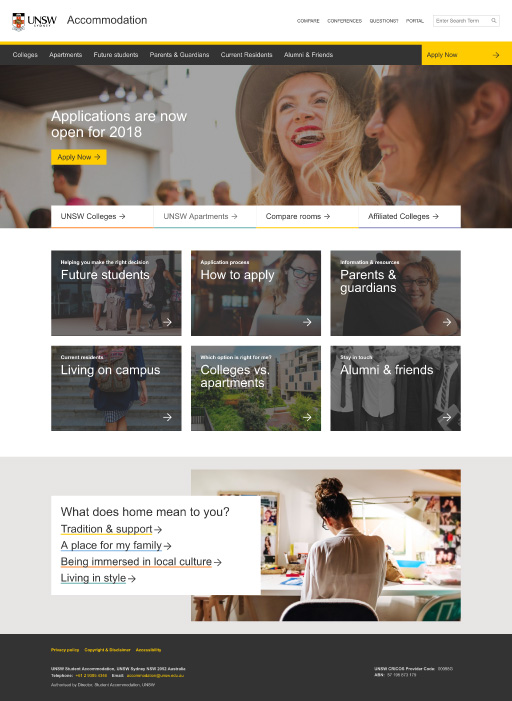
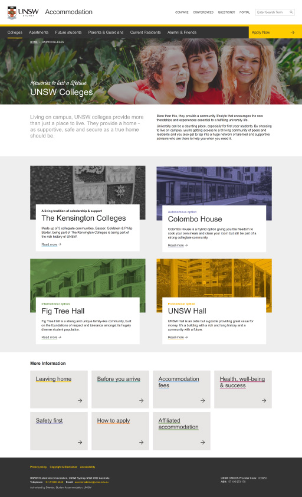
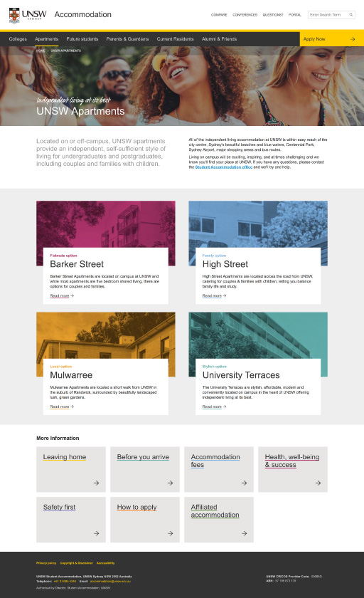
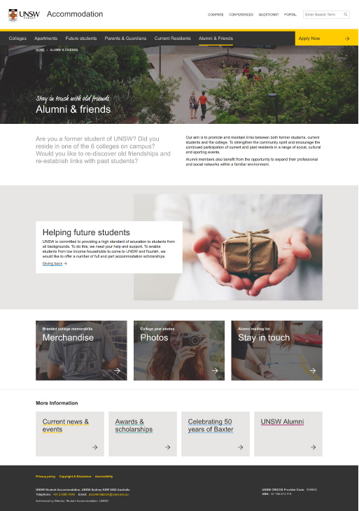
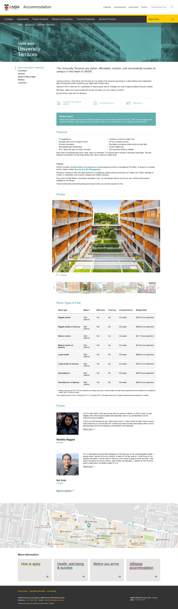
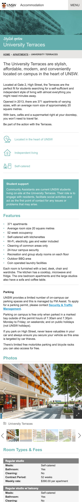
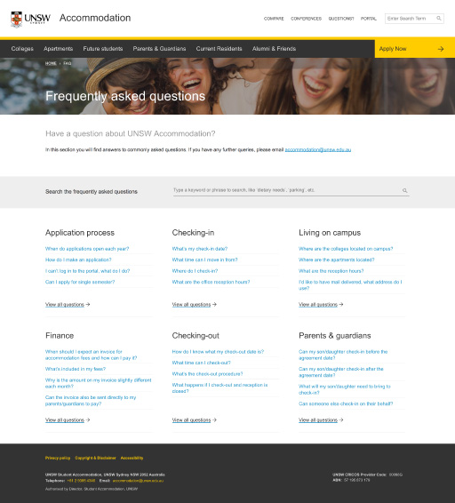
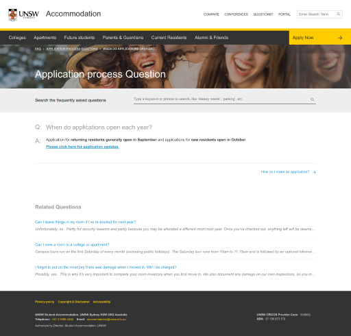

Lorem ipsum dolor sit amet, consectetur adipisicing elit. Omnis nulla, magnam molestias earum reiciendis neque. Praesentium accusamus unde necessitatibus vero a repudiandae illo, amet, inventore adipisci consectetur quae eveniet voluptas voluptatum.

[Patternlab](http://styleguide.accom.thislittleduck-sites.com/)

  

    

      <picture>
        <source srcset="unsw-accommodation--01.jpg 1x, unsw-accommodation--01@2x.jpg 2x">
        
      </picture>
    

    

      <picture>
        <source srcset="unsw-accommodation--02.jpg 1x, unsw-accommodation--02@2x.jpg 2x">
        
      </picture>
    

  

  

    

      <picture>
        <source srcset="unsw-accommodation--03.jpg 1x, unsw-accommodation--03@2x.jpg 2x">
        
      </picture>
    

    

      <picture>
        <source srcset="unsw-accommodation--04.jpg 1x, unsw-accommodation--04@2x.jpg 2x">
        
      </picture>
    

  

  

    

      <picture>
        <source srcset="unsw-accommodation--05.jpg 1x, unsw-accommodation--05@2x.jpg 2x">
        
      </picture>
    

    

      <picture>
        <source srcset="unsw-accommodation--06.jpg 1x, unsw-accommodation--06@2x.jpg 2x">
        
      </picture>
    

  

  

    

      <picture>
        <source srcset="unsw-accommodation--07.jpg 1x, unsw-accommodation--07@2x.jpg 2x">
        
      </picture>
    

    

      <picture>
        <source srcset="unsw-accommodation--08.jpg 1x, unsw-accommodation--08@2x.jpg 2x">
        
      </picture>
    

  

