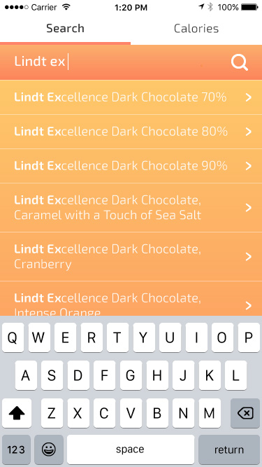
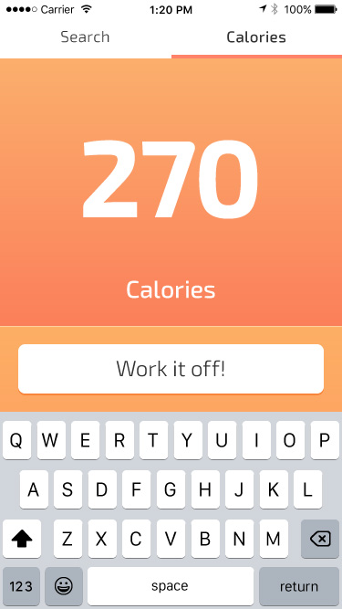
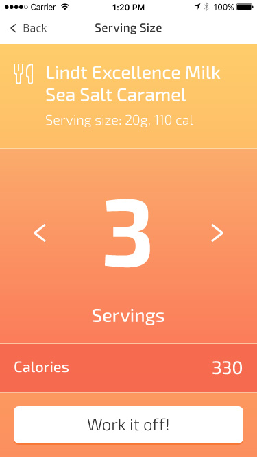
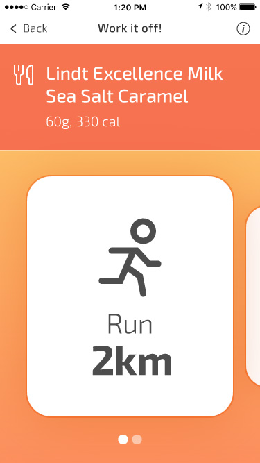
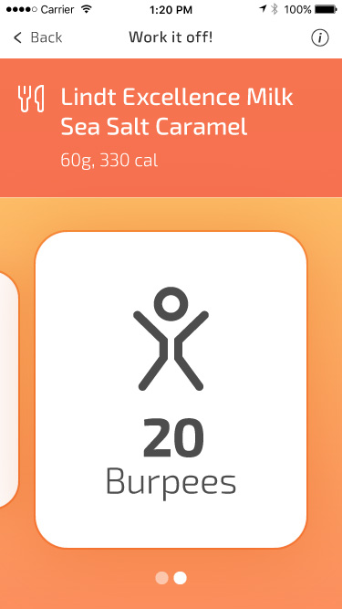

This app is based on the simple idea that if you want a snack, you can 'work it off'. Select your snack or input your calories, and Work it Off! calculates an activity for you to counterbalance your treat.

  

    

      

        <picture>
          <source srcset="work-it-off_01-search.jpg 1x, work-it-off_01-search@2x.jpg 2x">
          
        </picture>
       

    

    

      

        <picture>
          <source srcset="work-it-off_02-calories.jpg 1x, work-it-off_02-calories@2x.jpg 2x">
          
        </picture>
       

    

    

      

        <picture>
          <source srcset="work-it-off_03-serving.jpg 1x, work-it-off_03-serving@2x.jpg 2x">
          
        </picture>
       

    

  

  

    

      

        <picture>
          <source srcset="work-it-off_04-run.jpg 1x, work-it-off_04-run@2x.jpg 2x">
          
        </picture>
       

    

    

      

        <picture>
          <source srcset="work-it-off_05-burpee.jpg 1x, work-it-off_05-burpee@2x.jpg 2x">
          
        </picture>
       

    

  

